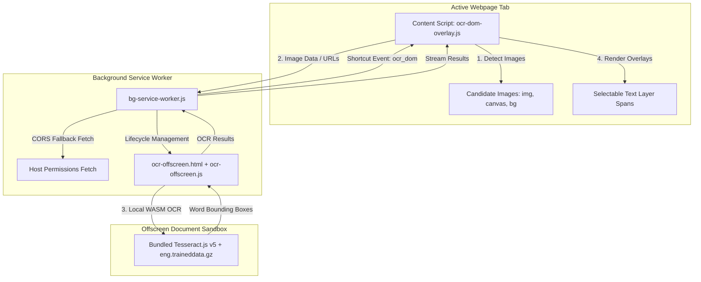

# Webpage DOM OCR & Interactive Live Text Overlay Implementation Plan

> **For agentic workers:** REQUIRED SUB-SKILL: Use superpowers:subagent-driven-development to implement this plan task-by-task. Steps use checkbox (`- [ ]`) syntax for tracking.

**Goal:** Add an on-demand keyboard shortcut (`ocr_dom`, with no default keys) to the Unified Toolkit extension that performs 100% offline OCR across all visible candidate images on the active webpage's DOM, overlaying an interactive, selectable text layer directly on top of the images.

**Architecture:** An MV3-compliant Offscreen Document (`ocr-offscreen.html`) hosts a fully bundled Tesseract.js v5 WebAssembly engine and local `eng.traineddata.gz` model to bypass host-page CSP restrictions. The background service worker routes image data between the content script and offscreen worker, providing CORS bypass via extension host permissions. A content script (`ocr-dom-overlay.js`) detects candidate images, scales the recognized word bounding boxes, and injects selectable transparent text spans directly over each image.

**Architecture Diagram:**



**Tech Stack:** JavaScript (ES2022), Chrome Extensions MV3, Chrome Offscreen API, Tesseract.js v5 (WebAssembly), HTML5 Canvas, CSS Grid/Absolute positioning.

## Global Constraints

- Must run 100% offline with zero external network requests during OCR.
- Zero default shortcut key for `ocr_dom` in `manifest.json`.
- Strict MV3 Content Security Policy compliance (all scripts, wasm, and models bundled locally).
- CRITICAL USER RULE: DO NOT PERFORM GIT ADD, COMMIT, OR PUSH OPERATIONS UNDER ANY CIRCUMSTANCES.

---

### Task 1: Bundled Offline Tesseract.js Assets

**Files:**
- Create: `c:\Users\Hause\Documents\Code\Toolkit\Toolkit\ocr\tesseract.min.js`
- Create: `c:\Users\Hause\Documents\Code\Toolkit\Toolkit\ocr\worker.min.js`
- Create: `c:\Users\Hause\Documents\Code\Toolkit\Toolkit\ocr\tesseract-core-simd-lstm.wasm.js`
- Create: `c:\Users\Hause\Documents\Code\Toolkit\Toolkit\ocr\tesseract-core-lstm.wasm.js`
- Create: `c:\Users\Hause\Documents\Code\Toolkit\Toolkit\ocr\eng.traineddata.gz`

**Interfaces:**
- Consumes: Verified CDN asset endpoints for Tesseract.js v5.1.0 and fast English traineddata model.
- Produces: Fully self-contained local `ocr/` directory bundled inside the extension.

- [ ] **Step 1: Download and store Tesseract.js v5 assets into local `ocr/` directory**
  Download the 5 verified offline assets to `c:\Users\Hause\Documents\Code\Toolkit\Toolkit\ocr\`:
  - `tesseract.min.js` from `https://cdn.jsdelivr.net/npm/tesseract.js@5.1.0/dist/tesseract.min.js`
  - `worker.min.js` from `https://cdn.jsdelivr.net/npm/tesseract.js@5.1.0/dist/worker.min.js`
  - `tesseract-core-simd-lstm.wasm.js` from `https://cdn.jsdelivr.net/npm/tesseract.js-core@5.1.0/tesseract-core-simd-lstm.wasm.js`
  - `tesseract-core-lstm.wasm.js` from `https://cdn.jsdelivr.net/npm/tesseract.js-core@5.1.0/tesseract-core-lstm.wasm.js`
  - `eng.traineddata.gz` from `https://cdn.jsdelivr.net/npm/@tessdata/eng@1.0.0/eng.traineddata.gz`

- [ ] **Step 2: Verify asset presence and non-zero byte size**
  Verify all 5 files exist in `ocr/` and have expected sizes (e.g. `eng.traineddata.gz` ~4.5MB).

---

### Task 2: Manifest V3 Configuration & Permissions

**Files:**
- Modify: [`c:\Users\Hause\Documents\Code\Toolkit\Toolkit\manifest.json`](file:///c:/Users/Hause/Documents/Code/Toolkit/Toolkit/manifest.json)

**Interfaces:**
- Consumes: Manifest V3 schema.
- Produces: Registered `offscreen` permission, `ocr_dom` command, and `ocr/*` web accessible resources.

- [ ] **Step 1: Update `manifest.json`**
  - Add `"offscreen"` to `permissions`.
  - Add `ocr_dom` to `commands` with description `"Toggle DOM Image OCR"` and no `suggested_key`.
  - Add `web_accessible_resources` for `ocr/*` and `fast-inject.css` if necessary.

```diff
--- a/Toolkit/manifest.json
+++ b/Toolkit/manifest.json
@@ -14,3 +14,4 @@
     "alarms"
+    "offscreen"
   ],
@@ -82,2 +83,5 @@
     }
+    "ocr_dom": {
+      "description": "Toggle DOM Image OCR"
+    }
   }
```

- [ ] **Step 2: Validate JSON syntax**
  Verify `manifest.json` is valid JSON and adheres to MV3 extension schemas.

---

### Task 3: Offscreen Document OCR Engine

**Files:**
- Create: `c:\Users\Hause\Documents\Code\Toolkit\Toolkit\ocr-offscreen.html`
- Create: `c:\Users\Hause\Documents\Code\Toolkit\Toolkit\ocr-offscreen.js`

**Interfaces:**
- Consumes: `chrome.runtime.onMessage` messages with `{ target: 'offscreen', action: 'OCR_PROCESS_IMAGE', imageId, dataUrl }`.
- Produces: OCR results `{ success: true, imageId, width, height, words: [...] }` returned to sender.

- [ ] **Step 1: Create `ocr-offscreen.html`**
  ```html
  <!DOCTYPE html>
  <html>
  <head>
    <meta charset="utf-8">
    <title>Toolkit OCR Offscreen Worker</title>
    <script src="ocr/tesseract.min.js"></script>
    <script src="ocr-offscreen.js"></script>
  </head>
  <body></body>
  </html>
  ```

- [ ] **Step 2: Implement `ocr-offscreen.js`**
  - Initialize `Tesseract.createWorker` using local paths:
    ```javascript
    const worker = await Tesseract.createWorker('eng', 1, {
      workerPath: chrome.runtime.getURL('ocr/worker.min.js'),
      corePath: chrome.runtime.getURL('ocr/tesseract-core-simd-lstm.wasm.js'),
      langPath: chrome.runtime.getURL('ocr'),
      gzip: true,
      cacheMethod: 'none'
    });
    ```
  - Handle `OCR_PROCESS_IMAGE`:
    - Call `worker.recognize(dataUrl)`.
    - Extract `ret.data.words.map(w => ({ text: w.text, bbox: w.bbox }))`.
    - Respond with `{ success: true, imageId, width: ret.data.width, height: ret.data.height, words }`.
  - Handle idle timeout: if no requests in 30 seconds, notify background or terminate worker.

---

### Task 4: Background Service Worker Routing & Lifecycle

**Files:**
- Modify: [`c:\Users\Hause\Documents\Code\Toolkit\Toolkit\bg-service-worker.js`](file:///c:/Users/Hause/Documents/Code/Toolkit/Toolkit/bg-service-worker.js)

**Interfaces:**
- Consumes: `chrome.commands.onCommand` for `ocr_dom`, messages from content script.
- Produces: Active offscreen document management, cross-origin image data URL conversion, message dispatch.

- [ ] **Step 1: Implement Offscreen Document Helper**
  - Add `ensureOffscreenDocument()` and `closeOffscreenDocument()`.
  - Use `chrome.offscreen.hasDocument()` (or track state) and `chrome.offscreen.createDocument`.

- [ ] **Step 2: Add `ocr_dom` Command Handler**
  - On `c === 'ocr_dom'`:
    - Verify `tab?.id` and `tab.url && /^https?:\/\//i.test(tab.url)`.
    - Send `{ action: 'toggle_ocr' }` to `tab.id`.

- [ ] **Step 3: Add Message Handlers for Content Script & CORS Fetching**
  - On `action: 'ocr_process_image'`:
    - Ensure offscreen document is ready.
    - If `dataUrl` is provided, forward to offscreen.
    - If `imgUrl` is cross-origin, fetch via background `fetch(imgUrl)`, convert to Data URL using `FileReader`, and forward to offscreen.
    - Send recognition response back to content script.

---

### Task 5: Content Script DOM Scanner & Interactive Live Text Overlay

**Files:**
- Create: `c:\Users\Hause\Documents\Code\Toolkit\Toolkit\ocr-dom-overlay.js`
- Create: `c:\Users\Hause\Documents\Code\Toolkit\Toolkit\ocr-dom-overlay.css`

**Interfaces:**
- Consumes: `toggle_ocr` message from background service worker.
- Produces: Live text overlay DOM structure overlaid precisely onto each image.

- [ ] **Step 1: Implement DOM Scanner & Image Extraction in `ocr-dom-overlay.js`**
  - Track `window.__TOOLKIT_OCR_ACTIVE__`.
  - If already active when `toggle_ocr` arrives:
    - Query and remove all `.toolkit-ocr-layer` containers.
    - Set `window.__TOOLKIT_OCR_ACTIVE__ = false`.
    - Call `showPillToast(tab.id, 'OCR dismissed', 1200)`.
    - Return.
  - If inactive:
    - Set `window.__TOOLKIT_OCR_ACTIVE__ = true`.
    - Query candidate elements:
      - `img` (naturalWidth > 48 && naturalHeight > 48 && clientWidth > 48).
      - `canvas` (width > 48 && height > 48).
    - If 0 images found, show `showPillToast('No candidate images found on page', 1500)` and exit.
    - Show `showPillToast('Scanning images for text... (0/' + images.length + ')', 2000)`.

- [ ] **Step 2: Implement Overlay Placement & Coordinate Scaling**
  - For each image:
    - Convert image to DataURL via canvas `drawImage` (or pass `src` if cross-origin).
    - Send to background via `chrome.runtime.sendMessage({ action: 'ocr_process_image', ... })`.
    - Calculate scale:
      - `const rect = img.getBoundingClientRect();`
      - `const scaleX = rect.width / res.width;`
      - `const scaleY = rect.height / res.height;`
    - Create `.toolkit-ocr-layer` positioned absolutely over image.
    - For each word in `res.words`:
      - Create `<span class="toolkit-ocr-word">${escapeHtml(word.text)}</span>`.
      - Position:
        - `left: ${rect.left + window.scrollX + word.bbox.x0 * scaleX}px;`
        - `top: ${rect.top + window.scrollY + word.bbox.y0 * scaleY}px;`
        - `width: ${(word.bbox.x1 - word.bbox.x0) * scaleX}px;`
        - `height: ${(word.bbox.y1 - word.bbox.y0) * scaleY}px;`
        - `font-size: ${(word.bbox.y1 - word.bbox.y0) * scaleY * 0.85}px;`
    - Append to document body or relative wrapper.
    - Update progress toast.

- [ ] **Step 3: Implement Live Text Overlay CSS in `ocr-dom-overlay.css`**
  - `.toolkit-ocr-layer`: `position: absolute; pointer-events: none; z-index: 2147483640;`
  - `.toolkit-ocr-word`:
    - `position: absolute;`
    - `pointer-events: auto;`
    - `user-select: text !important; -webkit-user-select: text !important;`
    - `color: transparent;`
    - `background: transparent;`
    - `cursor: text;`
    - `line-height: 1;`
  - `.toolkit-ocr-word::selection`:
    - `background: rgba(59, 130, 246, 0.45) !important;`
    - `color: #ffffff !important;`

- [ ] **Step 4: Register Content Script in `manifest.json`**
  - Add `ocr-dom-overlay.js` and `ocr-dom-overlay.css` to `content_scripts` matches `<all_urls>`.

---

### Task 6: End-to-End Verification & Walkthrough

**Files:**
- Verify: [`c:\Users\Hause\Documents\Code\Toolkit\Toolkit\manifest.json`](file:///c:/Users/Hause/Documents/Code/Toolkit/Toolkit/manifest.json)
- Verify: [`c:\Users\Hause\Documents\Code\Toolkit\Toolkit\bg-service-worker.js`](file:///c:/Users/Hause/Documents/Code/Toolkit/Toolkit/bg-service-worker.js)
- Verify: [`c:\Users\Hause\Documents\Code\Toolkit\Toolkit\ocr-dom-overlay.js`](file:///c:/Users/Hause/Documents/Code/Toolkit/Toolkit/ocr-dom-overlay.js)
- Verify: [`c:\Users\Hause\Documents\Code\Toolkit\Toolkit\ocr-offscreen.js`](file:///c:/Users/Hause/Documents/Code/Toolkit/Toolkit/ocr-offscreen.js)

- [ ] **Step 1: Manifest & Configuration Check**
  - Verify `manifest.json` loads cleanly in Chrome without warnings or CSP violations.
  - Verify `ocr_dom` command exists with blank shortcut.

- [ ] **Step 2: Functional OCR Live Text Test**
  - Test on a sample webpage with text in an image.
  - Verify progress toast appears.
  - Verify words are selectable with mouse and can be copied (`Ctrl+C`) and pasted into notepad.
  - Verify pressing shortcut a 2nd time dismisses all overlays cleanly.

- [ ] **Step 3: Strict Safety Check**
  - Verify **zero git add/commit/push commands** were executed.
